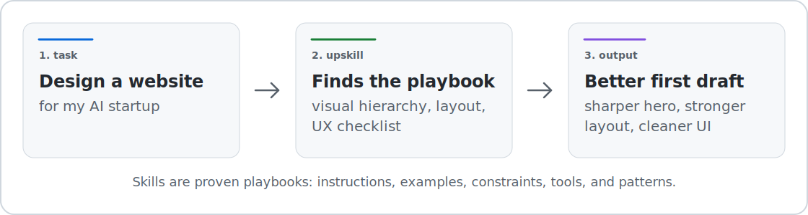

<h1 align="center">upskill</h1>

<p align="center">
  <strong>The skill layer for AI agents.</strong>
  <br />
  Give your assistant proven playbooks before it starts real work.
</p>

<p align="center">
  <a href="https://www.npmjs.com/package/@autoloops/upskill"></a>
  <a href="./LICENSE"></a>
  <a href="https://upskill.autoloops.ai"></a>
  <a href="https://upskill.autoloops.ai/stats"></a>
</p>

<p align="center">
  
</p>

## What is upskill?

upskill helps AI assistants use the right skill before they start working.

A skill is a proven playbook: instructions, examples, constraints, tools, and patterns for a specific kind of work. Instead of asking an agent to invent a pitch-deck structure, design system, inbox triage process, auth flow, research workflow, or browser automation script from memory, upskill finds the best existing playbook and puts it in context first.

Use it for serious work across code, docs, slides, email, research, spreadsheets, browser tasks, design, data, auth, cloud, CRM, support, and automation.

## Quickstart

Paste this into Claude Code, Cursor, Codex, Cline, Windsurf, or any shell-capable AI assistant:

```text
Install upskill for this assistant: run npm install -g @autoloops/upskill && upskill install; ask me four setup choices before changing config: telemetry on/off, local context/env-var names on/off, submissions on/off, and search scope verified/reviewed/community; apply my answers with upskill config set; run npx -y skills add Autoloops/upskill/skill; ask before adding the persistent rule; if I say yes, append the upskill rule to CLAUDE.md, AGENTS.md, .cursorrules, .clinerules, .windsurfrules, or ~/.claude/CLAUDE.md without overwriting anything.
```

For humans who want to run it directly:

```bash
npm install -g @autoloops/upskill
upskill install
upskill find "triage my inbox and surface what needs a reply today"
```

## Why upskill?

AI agents are generalists. When they start from memory, they improvise.

| Work | Without upskill | With upskill |
|---|---|---|
| Data parsing | Writes a brittle parser | Uses the right library and edge-case checklist |
| Pitch decks | Produces a generic template | Follows a narrative arc and slide-quality rubric |
| Email | Lists unread messages | Builds a prioritized action queue |
| Research | Summarizes loosely | Produces a cited synthesis with gaps and sources |
| Auth | Misses callbacks, scopes, or tokens | Follows a provider-specific flow |
| UI | Generates generic layouts | Uses a design and component playbook |
| Browser tasks | Clicks through fragile selectors | Uses a tested automation workflow |

The result: fewer retries, less token waste, and better output on the first pass.

## Demo

**Task:** `Make me a polished 12-slide seed deck as an editable PPTX`

Without upskill, an assistant usually starts from a generic deck outline:

```text
1. Title
2. Problem
3. Solution
4. Market
5. Product
6. Business model
7. Team
8. Ask
```

The slides look familiar because the agent is guessing from memory: weak narrative, inconsistent visuals, no speaker notes, and no real investor-quality review pass.

With upskill, the assistant can start from a deck-writing and PPTX playbook:

```text
upskill find "create a polished seed pitch deck as an editable pptx"
upskill inspect <pitch-deck-or-pptx-skill>
```

Then it follows the playbook:

| Deck part | What changes with upskill |
|---|---|
| Narrative | Hook, problem, insight, solution, proof, market, GTM, ask |
| Slide quality | One idea per slide, stronger hierarchy, less filler text |
| Visual system | Consistent type, spacing, color, charts, and layout rules |
| PPTX output | Editable slides instead of a throwaway text outline |
| Review pass | Checks story gaps, weak claims, crowded slides, and missing evidence |

The difference is simple: the assistant got the right skill before it started.

## How it works

1. **Search** — the assistant runs `upskill find "<task>"`.
2. **Inspect** — it reads the best matching skill before execution.
3. **Apply** — it follows the proven playbook instead of going freehand.
4. **Improve** — if you opted in, it reports whether the skill worked.

```bash
upskill find "turn this customer feedback spreadsheet into the top 5 product themes"
upskill inspect <skill_id>
```

Once the assistant skill is installed, your agent can do this automatically before non-trivial tasks.

## Examples

### "Make me a 12-slide pitch deck"

upskill can surface a deck-writing skill with a narrative structure, slide order, quality bar, and review checklist, so the assistant does not produce another generic template.

### "Triage my inbox"

upskill can surface an email triage playbook: classify action/FYI/noise, rank by sender and urgency signals, and return only what needs attention today.

### "Research competitors"

upskill can surface a research workflow that separates claims from evidence, tracks sources, and produces a structured comparison instead of a loose summary.

### "Add auth to this app"

upskill can surface provider-specific setup guidance, expected env vars, scopes, callbacks, and implementation pitfalls before the assistant writes code.

## Trust and control

upskill is designed so the user stays in control.

| Default | Behavior |
|---|---|
| Verified search | Searches trusted sources first |
| Telemetry off | No outcome reporting unless enabled |
| Context sharing off | No local environment context unless enabled |
| Env values protected | Context sharing sends env-var names only, never values |
| Submissions off | No publishing unless enabled and confirmed |
| Rule approval | Persistent assistant rules are appended only after user approval |

Inspect settings anytime:

```bash
upskill config show
```

Change settings anytime:

```bash
upskill config set telemetry true
upskill config set context true
upskill config set submissions true
upskill config set search-scope verified
```

## Technical architecture

upskill has three pieces:

| Piece | What it does |
|---|---|
| CLI | Lets an assistant search, inspect, report outcomes, submit skills, and manage local privacy settings. |
| Assistant skill | Teaches Claude Code, Cursor, Codex, Cline, Windsurf, and similar agents to call upskill before non-trivial work. |
| Registry | Stores indexed skills, trust metadata, search vectors, source info, feedback stats, and compatibility signals. |

The core loop is intentionally simple:

1. A skill is indexed from a public source or submitted source.
2. The registry stores the skill text plus derived metadata: task tags, dependencies, auth requirements, env-var names, commands, permissions, warnings, trust level, source URL, and source commit.
3. An agent calls `upskill find "<task>"`.
4. The registry returns ranked skills with match explanations and missing requirements.
5. The agent calls `upskill inspect <skill_id>` and reads the full `SKILL.md`.
6. The agent follows the skill instead of improvising.
7. If telemetry is enabled, the agent reports whether the skill worked.

This is the important distinction: upskill is not trying to be another chat UI. It is a skill-selection layer that gives agents better context before execution.

## Security model

upskill is designed around inspection, pinning, and small payloads.

| Control | Behavior |
|---|---|
| Trust tiers | Search can be limited to `verified`, expanded to `reviewed`, or opened to `community`. |
| Pinned sources | Skills resolve to source metadata, including GitHub URL/path/ref data where available, so agents can inspect what they are using. |
| No auto-install | `find` and `inspect` return instructions and source info. They do not silently install code or mutate your project. |
| Human-readable skills | The execution contract is `SKILL.md`, not an opaque binary package. Agents can inspect the instructions before following them. |
| Outbound safety checks | CLI payloads are scanned for known secret patterns before feedback or submissions leave the machine. |
| Submission guardrails | Local folder submissions are capped and scanned for secret-looking files and values before upload. |
| Local opt-ins | Telemetry, environment context, and submissions are disabled until explicitly enabled. |

For untrusted or community skills, the registry can apply heavier review before promotion: dependency extraction, auth detection, env-var detection, dangerous command checks, network/secret access warnings, and LLM-assisted security review. The goal is not to pretend every public skill is safe. The goal is to surface trust, requirements, and warnings before an agent uses it.

## Vetted, fresh, stack-aware

Good recommendations need more than keyword search.

| Signal | Why it matters |
|---|---|
| Vetted sources | Vendor-official and curated sources should rank above random public submissions. |
| Fresh indexing | Skills can be updated faster than model training data, so agents get newer workflows. |
| Environment fit | If context sharing is enabled, skills that match installed CLIs and available env-var names can rank higher. |
| Auth fit | A Slack skill that needs Composio, a GitHub skill that needs `gh auth`, and an Exa skill that needs `EXA_API_KEY` should not be treated as interchangeable. |
| Feedback loop | Skills that work should rise. Skills that fail for real agents should sink. |

Example: if an agent has `gh` installed and GitHub auth available, a GitHub PR review skill that uses the GitHub CLI is a better recommendation than a generic code-review prompt. If the agent has `COMPOSIO_API_KEY`, broker-based Gmail or Slack skills become more useful than skills that require a manual OAuth setup.

## Ranking signals

Every result includes a match explanation so agents do not have to trust a black box.

| Signal | Meaning |
|---|---|
| `name_match` | Query terms match the skill name. This is one of the strongest signals. |
| `text` | Full-text keyword overlap over the skill name, description, tags, and indexed text. |
| `vec` | Semantic/vector similarity when embeddings are available. Useful for paraphrases. |
| `trust` | `verified` > `reviewed` > `community`. |
| Environment fit | Required commands, package managers, runtimes, MCP servers, and env-var names match the agent's environment. |
| Missing requirements | Missing auth, env vars, commands, or package managers reduce usefulness. |
| Warnings | Risky commands, unclear auth, weak descriptions, or ambiguous tasks can lower confidence. |
| Feedback | Successes, failures, and workaround codes from prior runs improve future ranking. |
| Popularity | Installs, GitHub stars, forks, and freshness are tie-breakers, not the core ranking signal. |

A strong hit usually has either a literal name match or a combination of high text relevance, semantic relevance, trust, and environment fit. The registry should explain why a skill ranked, not just return a mysterious score.

## Privacy and data flow

Default behavior is intentionally small.

All registry requests include an anonymous local install ID, CLI version, and user agent so the server can handle client registration and compatibility. That ID is not your name, email, repo, or workspace path.

| Action | What is sent |
|---|---|
| `upskill find` | The search query and configured search scope. If context sharing is enabled, it may also send installed command names and env-var names. |
| `upskill inspect` | The skill ID being fetched. |
| `upskill report` | Only if telemetry is enabled: skill version ID, outcome, task kind, failure codes, and workaround codes. |
| `upskill submit` | Only if submissions are enabled: the skill folder or source reference after local safety checks. |

What is not sent by default:

- env-var values
- raw logs
- private source code
- shell history
- file paths from your project
- identifying user data for outcome telemetry

Self-hosted or private registries can be used by setting:

```bash
UPSKILL_URL=https://your-registry.example.com
upskill config set server https://your-registry.example.com
```

## Why this solves the problem

Models are broad generalists. Serious work needs task-specific process.

The usual agent failure mode is not that the model cannot write text or code. It is that it starts from vague memory, skips the boring edge cases, misses tool-specific setup, and repeats patterns that were common in training data but wrong for the current task.

upskill changes the starting point:

| Without upskill | With upskill |
|---|---|
| Agent guesses the workflow | Agent starts from a proven workflow |
| Agent invents requirements | Agent sees dependencies, auth, commands, and warnings |
| Agent repeats generic patterns | Agent uses task-specific examples and constraints |
| Agent learns nothing from failure | Outcome feedback improves future ranking |
| Human has to remember the right docs | Agent pulls the right skill before execution |

The long-term bet is simple: a skill registry should become for AI agents what package registries became for programmers. Agents should not reinvent common work every time.

## What's next

- **Approval workflow**: clearer promotion paths from submitted skills to reviewed and verified skills.
- **Richer metadata extraction**: stronger detection for task fit, auth, dependencies, side effects, and required tools.
- **Embeddings everywhere**: better semantic search over skill descriptions, summaries, examples, and task tags.
- **Registry-hosted distributions**: support sources beyond GitHub while keeping hashes and provenance.
- **Verified authorship**: stronger proof that official vendor skills actually come from the vendor.
- **Company registries**: private skill registries for teams that need internal workflows behind a firewall.
- **Better feedback stats**: compatibility by agent, OS, tools, auth path, and failure mode.

## CLI

```bash
upskill find "build a clean 12 slide seed pitch deck"
upskill find "parse uploaded CSV files with headers and quoted fields"
upskill find "research competitors and produce a cited comparison"
upskill inspect <skill_id>
upskill config show
```

## Contribute skills

If you have a workflow that reliably makes an assistant better, turn it into a skill.

Good skills are not clever prompts. They are reusable work patterns:

- how to triage an inbox
- how to build a pitch deck
- how to review a pull request
- how to query a knowledge base
- how to parse messy files
- how to automate a browser workflow
- how to research with citations
- how to follow a product or design standard

The goal is simple: every agent should start important work with the best available playbook.

## License

MIT.
