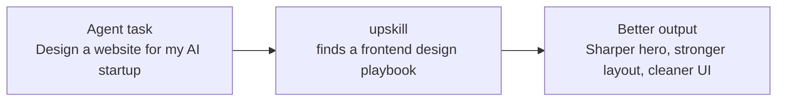

<div align="center">
  <h3>upskill</h3>

  <p>
    <strong>The skill layer for AI agents.</strong><br />
    Give your assistant proven playbooks before it starts real work.
  </p>

  <a href="https://www.npmjs.com/package/@autoloops/upskill"></a>
  <a href="./LICENSE"></a>
  <a href="https://upskill.autoloops.ai"></a>
  <a href="https://upskill.autoloops.ai/stats"></a>

  <br />
  <br />

  <a href="#quickstart">Quickstart</a>
  ·
  <a href="#why-upskill">Why upskill</a>
  ·
  <a href="#examples">Examples</a>
  ·
  <a href="#trust-and-control">Trust</a>
</div>



---

## What is upskill?

upskill helps AI assistants use the right skill before they start working.

A skill is a proven playbook: instructions, examples, constraints, tools, and patterns for a specific kind of work. Instead of asking an agent to invent a pitch-deck structure, design system, inbox triage process, auth flow, research workflow, or browser automation script from memory, upskill finds the best existing playbook and puts it in context first.

Use it for serious work across code, docs, slides, email, research, spreadsheets, browser tasks, design, data, auth, cloud, CRM, support, and automation.

## Quickstart

Paste this into Claude Code, Cursor, Codex, Cline, Windsurf, or any shell-capable AI assistant:

```text
Install upskill for this assistant: run npm install -g @autoloops/upskill && upskill install; ask me four setup choices before changing config: telemetry on/off, local context/env-var names on/off, submissions on/off, and search scope verified/reviewed/community; apply my answers with upskill config set; run npx -y skills add Autoloops/upskill/skill; ask before adding the persistent rule; if I say yes, append the upskill rule to CLAUDE.md, AGENTS.md, .cursorrules, .clinerules, .windsurfrules, or ~/.claude/CLAUDE.md without overwriting anything.
```

For humans who want to run it directly:

```bash
npm install -g @autoloops/upskill
upskill install
upskill find "triage my inbox and surface what needs a reply today"
```

## Why upskill?

AI agents are generalists. When they start from memory, they improvise.

| Work | Without upskill | With upskill |
|---|---|---|
| Data parsing | Writes a brittle parser | Uses the right library and edge-case checklist |
| Pitch decks | Produces a generic template | Follows a narrative arc and slide-quality rubric |
| Email | Lists unread messages | Builds a prioritized action queue |
| Research | Summarizes loosely | Produces a cited synthesis with gaps and sources |
| Auth | Misses callbacks, scopes, or tokens | Follows a provider-specific flow |
| UI | Generates generic layouts | Uses a design and component playbook |
| Browser tasks | Clicks through fragile selectors | Uses a tested automation workflow |

The result: fewer retries, less token waste, and better output on the first pass.

## Demo

**Task:** `Make me a polished 12-slide seed deck as an editable PPTX`

Without upskill, an assistant usually starts from a generic deck outline:

```text
1. Title
2. Problem
3. Solution
4. Market
5. Product
6. Business model
7. Team
8. Ask
```

The slides look familiar because the agent is guessing from memory: weak narrative, inconsistent visuals, no speaker notes, and no real investor-quality review pass.

With upskill, the assistant can start from a deck-writing and PPTX playbook:

```text
upskill find "create a polished seed pitch deck as an editable pptx"
upskill inspect <pitch-deck-or-pptx-skill>
```

Then it follows the playbook:

| Deck part | What changes with upskill |
|---|---|
| Narrative | Hook, problem, insight, solution, proof, market, GTM, ask |
| Slide quality | One idea per slide, stronger hierarchy, less filler text |
| Visual system | Consistent type, spacing, color, charts, and layout rules |
| PPTX output | Editable slides instead of a throwaway text outline |
| Review pass | Checks story gaps, weak claims, crowded slides, and missing evidence |

The difference is simple: the assistant got the right skill before it started.

## How it works

1. **Search** — the assistant runs `upskill find "<task>"`.
2. **Inspect** — it reads the best matching skill before execution.
3. **Apply** — it follows the proven playbook instead of going freehand.
4. **Improve** — if you opted in, it reports whether the skill worked.

```bash
upskill find "turn this customer feedback spreadsheet into the top 5 product themes"
upskill inspect <skill_id>
```

Once the assistant skill is installed, your agent can do this automatically before non-trivial tasks.

## Examples

### "Make me a 12-slide pitch deck"

upskill can surface a deck-writing skill with a narrative structure, slide order, quality bar, and review checklist, so the assistant does not produce another generic template.

### "Triage my inbox"

upskill can surface an email triage playbook: classify action/FYI/noise, rank by sender and urgency signals, and return only what needs attention today.

### "Research competitors"

upskill can surface a research workflow that separates claims from evidence, tracks sources, and produces a structured comparison instead of a loose summary.

### "Add auth to this app"

upskill can surface provider-specific setup guidance, expected env vars, scopes, callbacks, and implementation pitfalls before the assistant writes code.

## Trust and control

upskill is designed so the user stays in control.

| Default | Behavior |
|---|---|
| Verified search | Searches trusted sources first |
| Telemetry off | No outcome reporting unless enabled |
| Context sharing off | No local environment context unless enabled |
| Env values protected | Context sharing sends env-var names only, never values |
| Submissions off | No publishing unless enabled and confirmed |
| Rule approval | Persistent assistant rules are appended only after user approval |

Inspect settings anytime:

```bash
upskill config show
```

Change settings anytime:

```bash
upskill config set telemetry true
upskill config set context true
upskill config set submissions true
upskill config set search-scope verified
```

## CLI

```bash
upskill find "build a clean 12 slide seed pitch deck"
upskill find "parse uploaded CSV files with headers and quoted fields"
upskill find "research competitors and produce a cited comparison"
upskill inspect <skill_id>
upskill config show
```

## Contribute skills

If you have a workflow that reliably makes an assistant better, turn it into a skill.

Good skills are not clever prompts. They are reusable work patterns:

- how to triage an inbox
- how to build a pitch deck
- how to review a pull request
- how to query a knowledge base
- how to parse messy files
- how to automate a browser workflow
- how to research with citations
- how to follow a product or design standard

The goal is simple: every agent should start important work with the best available playbook.

## License

MIT.
